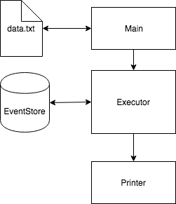
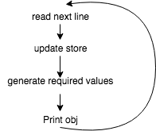

### Description:
##### The problem: 
The problem is to keep track of certain time window as a stream of events passes.
Information to keep track of within a time window are:
- The minimum value
- Maximum value 
- Number of events
- Sum of the values

##### The solution: 
The solution is based on a simple [minmax heap](https://en.wikipedia.org/wiki/Min-max_heap) core, materialized in `MinMaxPriorityQueue` that keeps track  of the minimum node and maximum node in `O(1)` which makes it suitable for our solution.

### Design 
The Design consists of an `EventStore` that keeps track fo the current time window events, 
and an iterator to go over the data lines of `data.txt`

The executor executes a `foreach` loop over the `iterator` where all the magic happens, as explained in the diagram:  
 

### Implementation
I tried to keep the implementation clean and as close to real world as possible (however you can find simpler, one method solutions in earlier commits of the `gitbunlde` that almost does the job)

- Type safety is respected 
- Models are bundled 
- Logic outside the executor is kept to a minimum (except for the model(s) operations) 
- Extensibility and future-proofing is considered

libraries used: 
- `Guava` (for `MinMaxPriorityQueue`)
- `Specs2`, `ScalaMock` for testing purposes

### Testing
There are two types of tests: 
- Unit tests
- One E2E test (ExecutorTest)

The Unit tests are standard unit tests that test individual functions within the model operations mainly.

The E2E test tests how the executor will run against a subset of the problem (found in `test.txt` solution and truth is checked by asserting directly as String)

### Performance Analysis
A cold run against `data.txt` finishes in `5 seconds` on a standard 2015 macbook 13", with subsequent runs averaging at `2 seconds`

time complexity analysis over code shows that the most time consuming operations are complete search operations (`sum` and `removeIf`) on the `heap` with complexity of `O(n)`

